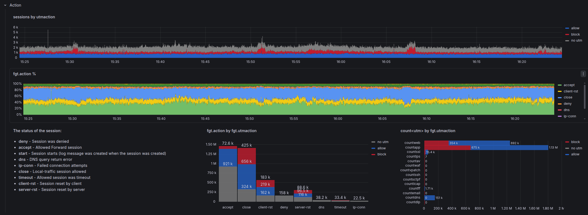
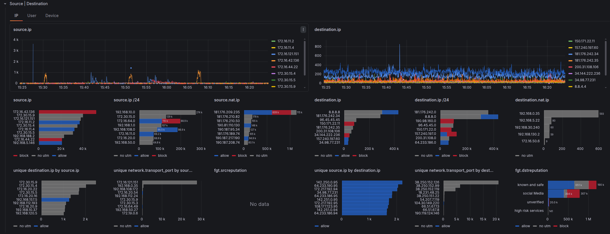
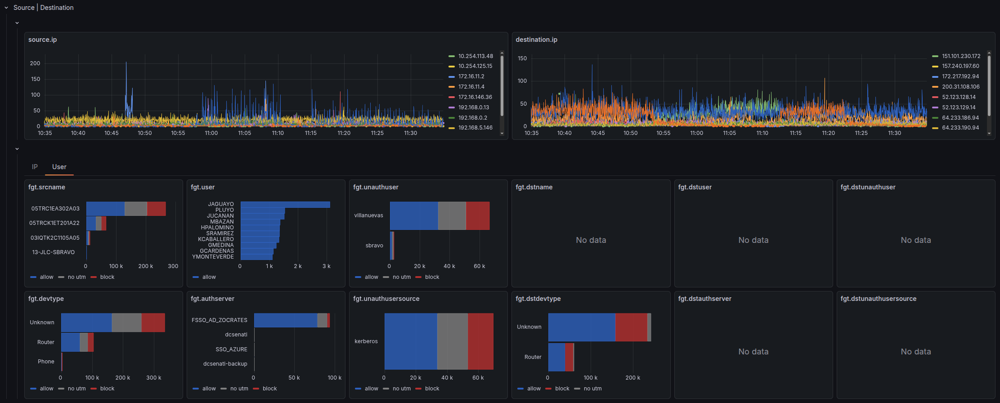

# FortiGate

## Variables

| Variable | Query Source | Notes |
|----------|--------------|-------|
| `firewall` | `_stream: {fgt.type=$type}` | Populated from `log.syslog.hostname` |
| `vdom` | `_stream: {fgt.type=$type, log.syslog.hostname in (${firewall})}` | Virtual Domain from `fgt.vd` |
| `type` | Custom | `traffic`, `utm`, `event` |
| `subtype` | `_stream: {fgt.type=$type, log.syslog.hostname in (${firewall}), fgt.vd in (${vdom})}` | From `fgt.subtype` — typically `forward`, `local`, `multicast` |
| `policytype` | `_stream: {fgt.type=$type, log.syslog.hostname in (${firewall}), fgt.vd in (${vdom})}` | From `fgt.policytype` — typically `policy`. **Traffic-only**, no equivalent in UTM |
| `direction` | Custom | Options: `outbound`, `inbound`, `internal`, `external` |
| `action` | Base stream query | From `fgt.action` — `accept`, `drop`, `deny`, `close`, etc. |
| `Logsql` | Text | Custom filter, default `*` |
| `crscore` | switch | applies a risk score threshold filter when enabled, default `*` (off) *UTM-only** |

## Traffic 

### Base Query

```plaintext
_stream:{log.syslog.hostname in (${firewall:doublequote}),fgt.vd in (${vdom:doublequote}),fgt.type=${type:doublequote},fgt.subtype=${subtype:doublequote},fgt.policytype=${policytype:doublequote},network.direction in (${direction:doublequote}),fgt.logid!=0000000020}
| fgt.action:in(${action:doublequote}) AND ${Logsql:raw}
| NOT fgt.srccountry:Reserved
| stats by (fgt.srccountry) count() results
```

!!! note "Log ID Exclusion"
    The query filters out `fgt.logid!=0000000020` to avoid duplicate traffic close-session events that inflate counts.

### Metrics

The **Traffic** dashboard (`traffic-fortios.json`) is organized into direction tabs (outbound/inbound/internal/external), each with three metric sub-tabs:

| Sub-tab | Aggregation | Notes |
|---------|-------------|-------|
| Sessions | `count()` | One log ≈ one connection |
| Bytes | `sum(bytes)` | Total volume transferred |
| Risk Score | `sum(fgt.crscore)` | Cumulative [Threat Weight](https://docs.fortinet.com/document/fortigate/7.2.0/administration-guide/903511/threat-weight) score — FortiGate assigns points based on detected threats, UTM actions, IP reputation hits, and other risk factors. Unique to FortiGate; not available in PAN-OS |

Within each sub-tab, rows follow the standard [panel hierarchy](index.md#panel-hierarchy).

## UTM Dashboard

The **UTM** dashboard (`utm-fortios.json`) focuses on security engine events. It has the same direction-based tab structure as Traffic.

### crscore Variable

The **UTM** dashboard adds a unique `crscore` **switch variable** that applies a risk score threshold filter when enabled. This allows toggling between "all UTM events" and "high-risk UTM events only" without modifying the base query.

### Base Query

```plaintext
_stream:{fgt.type=${type:doublequote},fgt.subtype=${subtype:doublequote},log.syslog.hostname in (${firewall:doublequote}),fgt.vd in (${vdom:doublequote}),network.direction in (${direction:doublequote})}
| fgt.action:in(${action:doublequote}) AND ${Logsql:raw} AND ${crscore:raw}
| fgt.virus:*
| stats by (fgt.virus,fgt.action) count() results
| sort by (results) desc
| limit 10
```

### UTM Engines

**FortiGate UTM** — rows are shown or hidden based on the active subtype:

| Row | Always visible | Visible when `subtype` is… |
|-----|:--------------:|---------------------------|
| Metrics | ✓ | — |
| General | ✓ | — |
| Geo | ✓ | — |
| Source \| Destination | ✓ | — |
| User Agent \| URL \| Category | | `app-ctrl`, `webfilter`, `file-filter`, `ssl` |
| Application \| Application Category | | `app-ctrl` |
| File \| Virus \| Virus Category | | `virus` |
| Attack \| Severity \| URL | | `ips` |
| Resolved IP \| Question Name | | `dns` |
| matchfilename \| matchfiletype | | `file-filter` |

## Event Dashboards

FortiOS includes two additional dashboards that cover the `event` log type:

- **System** (`system-fortios.json`) — Health metrics, configuration changes, and login/logout attempts
- **SSL VPN** (`ssl-vpn-fortios.json`) — VPN session analysis: tunnel establishment, user connections, duration, and traffic

## Action

### Traffic

We combine the analysis of both `fgt.action` and `fgt.utmaction` in a timeline, percentage, and absolute fashion. The **UTM** dashboard further breaks down details by UTM engine (web filter, antivirus, IPS, etc.).

{data-gallery="action-gallery" data-title="Fortigate Action"}

### UTM

[Action]( https://github.com/dr4gon123/flores/blob/main/8.0/fields/action_descriptions.csv) values in security event logs reflect what the security engine did with the threat, not the firewall policy decision.
 

## Source | Destination

Three subtabs break down traffic by different identity dimensions:

### IP

IP-level analysis — the most granular view of who is talking to whom.

| Field | Description |
|-------|-------------|
| `source.ip` / `source.ip/24` | Top source IPs and /24 subnets by session count |
| `destination.ip` / `destination.ip/24` | Top destination IPs and /24 subnets |
| `source.nat.ip` / `destination.nat.ip` | NAT-translated addresses — useful for identifying NAT pools and translated destinations |
| `unique destination.ip by source.ip` | Fanout metric — how many distinct destinations each source is reaching |
| `unique source.ip by destination.ip` | Reverse fanout — how many sources are hitting each destination |
| `unique network.transport_port by source.ip` | Port diversity per source — high values suggest scanning or broad service use |
| `unique network.transport_port by destination.ip` | Port diversity per destination |
| `fgt.dstreputation` | FortiGuard IP reputation category of the destination |

The **bytes** metric sub-tab adds volume breakdowns (`sum`, `avg`, histogram) and duration percentiles (`p90`, `avg`) per IP.

{data-gallery="source-destination-gallery" data-title="Fortigate Source Destination - IP"}

### User

FortiGate collects user identity from authentication sessions (FSSO, RSSO, local auth) and maps it to traffic.

| Field | Description |
|-------|-------------|
| `fgt.user` | Authenticated source user |
| `fgt.unauthuser` | Unauthenticated source user (identity known but not authenticated) |
| `fgt.unauthusersource` | Method that identified the unauthenticated user |
| `fgt.dstuser` | Authenticated destination user |
| `fgt.dstunauthuser` | Unauthenticated destination user |
| `fgt.dstunauthusersource` | Method that identified the unauthenticated destination user |
| `fgt.dstname` | DNS name of the destination host |
| `fgt.dstgroup` | Destination user group |
| `fgt.dstauthserver` | Authentication server that verified the destination user |

{data-gallery="source-destination-gallery" data-title="Fortigate Source Destination - User"}

### Device

Device fingerprinting for both source and destination, populated when FortiGate identifies the device via DHCP, FSSO, or traffic inspection.

| Field | Description |
|-------|-------------|
| `fgt.srcname` | Source device hostname |
| `fgt.devtype` | Source device category (PC, Phone, Printer, etc.) |
| `fgt.osname` | Source OS name |
| `fgt.srcswversion` | Source OS version |
| `fgt.srchwvendor` | Source hardware vendor |
| `fgt.srcfamily` | Source device family |
| `fgt.dstname` | Destination device hostname |
| `fgt.dstdevtype` | Destination device category |
| `fgt.dstosname` | Destination OS name |
| `fgt.dstswversion` | Destination OS version |
| `fgt.dsthwvendor` | Destination hardware vendor |
| `fgt.dstfamily` | Destination device family |

## Service | Application

### Service Field

`fgt.service` can hold three different values depending on what matched:

1. An **Internet Service** name (e.g. `Google-DNS`) — if the destination matched a Fortinet Internet Service database entry
2. A **configured service object** name (e.g. `HTTPS`, `CUSTOM-APP`) — if the session matched a policy service object
3. A **protocol/port notation** (e.g. `tcp/443`) — if no service object matched

This inconsistency makes `fgt.service` unreliable for aggregation: the same port can appear under three different values depending on how the policy is configured. Use [`network.transport_port`](index.md#networktransport_port) instead.

{data-gallery="service-application-gallery" data-title="Fortigate Service Application"}

## Overrides

### Action Colors

Action values are color-coded consistently across all bar chart and timeseries panels. The convention is **blue = permissive, red = blocking**.

#### Traffic

| Color | Action values |
|-------|--------------|
| Blue | `allow` |
| Red | `block` |

#### UTM

Full UTM action value descriptions are documented in the [action_descriptions.csv](https://github.com/dr4gon123/flores/blob/main/8.0/fields/action_descriptions.csv).

| Color | Action values |
|-------|--------------|
| Blue | `allow`, `pass`, `passthrough`, `permit`, `exempt`, `pass_session`, `monitored`, `analytics`, `detected`, `log-only` |
| Red | `block`, `blocked`, `dropped`, `reject`, `reset`, `reset_client`, `reset_server`, `drop_session`, `deny`, `ban`, `ban-sender`, `quarantine-ip`, `quarantine-interface` |

### Unit Scaling

Fields are auto-scaled based on their name pattern:

| Pattern | Unit |
|---------|------|
| `*bytes` | Decimal bytes — auto-scales to KB, MB, GB |
| `*packets` | SI short — auto-scales to K, M, G |
| `*duration` | Duration format (s, m, h) |

## Dashboard Files

| Dashboard | File | Description |
|-----------|------|-------------|
| **Traffic** | [`traffic-fortios.json`](https://github.com/dr4gon123/flasi/blob/main/grafana/dev/FortiGate/traffic-fortios.json) | Session/connection analysis |
| **UTM** | [`utm-fortios.json`](https://github.com/dr4gon123/flasi/blob/main/grafana/dev/FortiGate/utm-fortios.json) | Web filter, AV, IPS analysis |
| **System** | [`system-fortios.json`](https://github.com/dr4gon123/flasi/blob/main/grafana/dev/FortiGate/system-fortios.json) | System events and configuration changes |
| **SSL VPN** | [`ssl-vpn-fortios.json`](https://github.com/dr4gon123/flasi/blob/main/grafana/dev/FortiGate/ssl-vpn-fortios.json) | VPN session analysis |
| **Data** | [`ingest-fortios.json`](https://github.com/dr4gon123/flasi/blob/main/grafana/dev/FortiGate/ingest-fortios.json) | Ingestion health and throughput |
| **Log Fields** | [`log-fields-fortios.json`](https://github.com/dr4gon123/flasi/blob/main/grafana/dev/FortiGate/log-fields-fortios.json) | Raw field explorer |
| **Streams** | [`streams-fortios.json`](https://github.com/dr4gon123/flasi/blob/main/grafana/dev/FortiGate/streams-fortios.json) | Data stream statistics |
