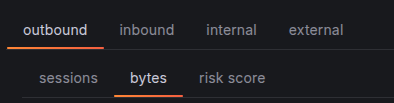
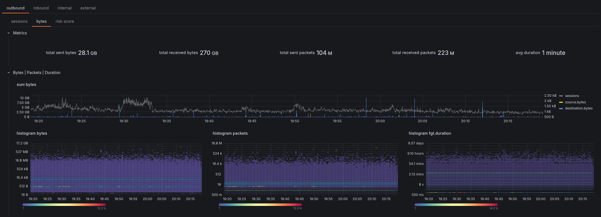
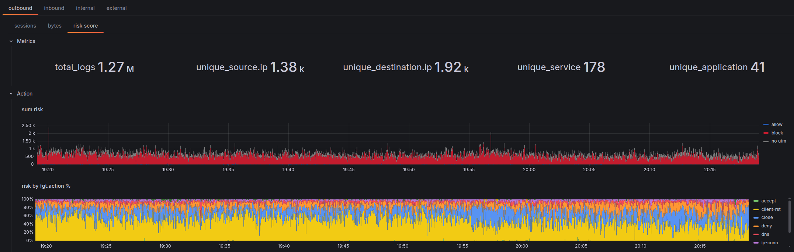
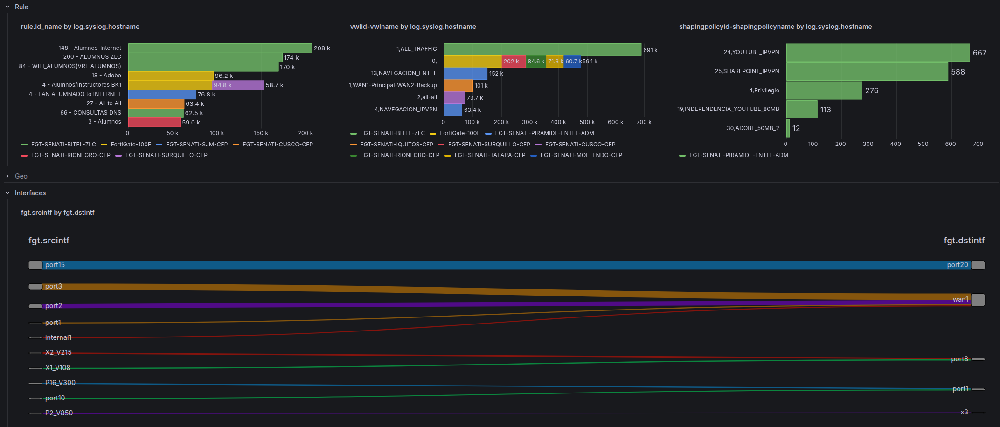
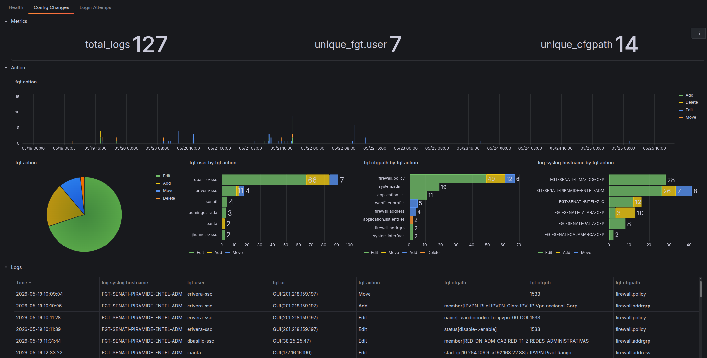
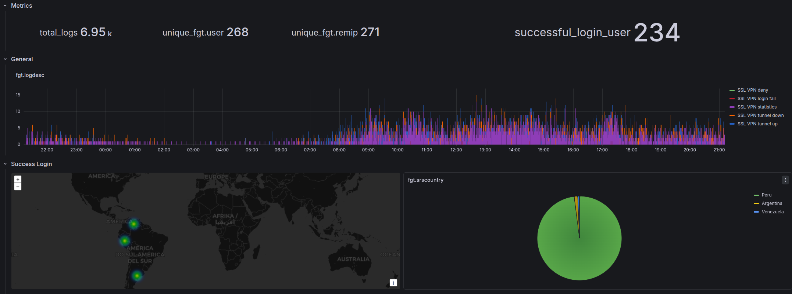

# FortiGate

FortiGate-specific dashboard details. For shared concepts — variables, base query structure, direction tabs, action analysis — see the [Dashboard Guide](index.md).

## Dashboards

| Dashboard | File | Description |
|-----------|------|-------------|
| **Traffic** | [`traffic-fortios.json`](https://github.com/dr4gon123/flasi/blob/main/grafana/dev/FortiGate/traffic-fortios.json) | Session/connection analysis |
| **UTM** | [`utm-fortios.json`](https://github.com/dr4gon123/flasi/blob/main/grafana/dev/FortiGate/utm-fortios.json) | UTM engines analysis |
| **System** | [`system-fortios.json`](https://github.com/dr4gon123/flasi/blob/main/grafana/dev/FortiGate/system-fortios.json) | Health metrics, configuration changes, and login/logout attempts |
| **SSL VPN** | [`ssl-vpn-fortios.json`](https://github.com/dr4gon123/flasi/blob/main/grafana/dev/FortiGate/ssl-vpn-fortios.json) | VPN session analysis: tunnel establishment, user connections, duration, and traffic |
| **Data** | [`ingest-fortios.json`](https://github.com/dr4gon123/flasi/blob/main/grafana/dev/FortiGate/ingest-fortios.json) | Ingestion health and throughput |
| **Log Fields** | [`log-fields-fortios.json`](https://github.com/dr4gon123/flasi/blob/main/grafana/dev/FortiGate/log-fields-fortios.json) | Raw field explorer |
| **Streams** | [`streams-fortios.json`](https://github.com/dr4gon123/flasi/blob/main/grafana/dev/FortiGate/streams-fortios.json) | Data stream explorer |

## Variables

All common variables are documented in the [Dashboard Guide](index.md#variables-filters). FortiGate adds two variables not present in PAN-OS:

| Variable | Notes |
|----------|-------|
| `policytype` | From `fgt.policytype` — typically `policy`. **Traffic-only**, no UTM equivalent |
| `crscore` | Switch variable — applies a risk score threshold filter when enabled. **Traffic and UTM only** |

## Traffic Dashboard

The [Traffic dashboard](grafana/prod/FortiGate/traffic-fortios.json) organizes analysis across two dimensions: direction (outer tabs) and metric type (inner sub-tabs).

### Metric Sub-tabs

Within each direction tab, three sub-tabs slice the same traffic data by a different primary metric:

| Sub-tab | Primary aggregation | Source\|Destination tabs |
|---------|--------------------|-|
| **Sessions** | `count()` — one log ≈ one connection | IP · User · Device |
| **Bytes** | `sum`, `avg`, `p90`, `histogram` for `network.bytes`, `network.packets`, `fgt.duration` | IP · User |
| **Risk Score** | `sum(fgt.crscore)` — cumulative [Threat Weight](https://docs.fortinet.com/document/fortigate/7.2.0/administration-guide/903511/threat-weight) | IP · User · Device |

### Sessions Tab

Follows the [standard panel hierarchy](index.md#panel-hierarchy). FortiGate-specific panels within each row:

#### Source | Destination — IP

| Source | Destination | Description |
|--------|-------------|-------------|
| `source.ip` | `destination.ip` | Top IPs by session count |
| `source.ip/24` | `destination.ip/24` | Top /24 subnets by session count |
| `source.nat.ip` | `destination.nat.ip` | NAT-translated addresses — useful for identifying NAT pools |
| `unique destination.ip by source.ip` | `unique source.ip by destination.ip` | Fanout — distinct IPs reached / reaching each endpoint |
| `unique network.transport_port by source.ip` | `unique network.transport_port by destination.ip` | Port diversity — high values suggest scanning |
| `fgt.srcreputation` | `fgt.dstreputation` | FortiGuard IP reputation score |

#### Source | Destination — User

FortiGate collects user identity from authentication sessions (FSSO, RSSO, local auth) and maps it to traffic.

| Source | Destination | Description |
|--------|-------------|-------------|
| `fgt.user` | `fgt.dstuser` | Authenticated user |
| `fgt.unauthuser` | `fgt.dstunauthuser` | Unauthenticated user (identity known, not authenticated) |
| `fgt.unauthusersource` | `fgt.dstunauthusersource` | Method used to identify the unauthenticated user |
| `fgt.group` | `fgt.dstgroup` | User group |
| `fgt.authserver` | `fgt.dstauthserver` | Authentication server |
| `fgt.srcname` | `fgt.dstname` | Device hostname |

#### Source | Destination — Device

Device fingerprinting for both source and destination, populated when FortiGate identifies the device via DHCP, FSSO, or traffic inspection.

| Source | Destination | Description |
|--------|-------------|-------------|
| `fgt.srcname` | `fgt.dstname` | Device hostname |
| `fgt.devtype` | `fgt.dstdevtype` | Device category (PC, Phone, Printer, etc.) |
| `fgt.osname` | `fgt.dstosname` | OS name |
| `fgt.srcswversion` | `fgt.dstswversion` | OS version |
| `fgt.srchwvendor` | `fgt.dsthwvendor` | Hardware vendor |
| `fgt.srcfamily` | `fgt.dstfamily` | Device family |

### Bytes Tab

The Bytes tab replaces session counts with volume and duration metrics. It adds a dedicated **Bytes | Packets | Duration** row that sits above the standard Geo / Interfaces / Rule rows.

#### Bytes | Packets | Duration Row

| Sub-row | Panels |
|---------|--------|
| `sum` | `sum(network.bytes)` and `sum(network.packets)` timeseries |
| `histogram` | Distribution histograms for `bytes`, `packets`, and `fgt.duration` |

The histograms show the *shape* of the distribution — useful for spotting bimodal patterns (e.g. small keep-alive packets mixed with large file transfers) that averages would hide.

#### Source | Destination — IP (Bytes)

Each panel group has **Sum** and **Avg** inner tabs:

| Panel group | Fields |
|-------------|--------|
| Bytes by address | `bytes source.ip` · `bytes source.ip/24` · `bytes source.nat.ip` · `bytes destination.ip` · `bytes destination.ip/24` · `bytes destination.nat.ip` |
| Duration by address | `duration source.ip` · `duration source.ip/24` · `duration source.nat.ip` · `duration destination.ip` · `duration destination.ip/24` · `duration destination.nat.ip` |

#### Source | Destination — User (Bytes)

| Panel group | Fields |
|-------------|--------|
| Bytes by user | `bytes fgt.user` · `bytes fgt.unauthuser` · `bytes fgt.group` · `bytes fgt.dstuser` · `bytes fgt.dstunauthuser` · `bytes fgt.dstgroup` |
| Duration by user | `duration fgt.user` · `duration fgt.unauthuser` · `duration fgt.group` · `duration fgt.dstuser` · `duration fgt.dstunauthuser` · `duration fgt.dstgroup` |

#### Application (Bytes)

Each panel has **Sum** and **Histogram** inner tabs:

| Panel | Description |
|-------|-------------|
| `bytes network.transport_port` | Bytes by `protocol/port` (e.g. `tcp/443`) |
| `bytes fgt.service` | Bytes by service name (see [service field caveat](#service-field)) |
| `bytes network.application` | Bytes by detected application |
| `bytes fgt.appcat` | Bytes by application category |

### Risk Score Tab

Mirrors the Sessions tab structure — same rows (Metrics, Action, Rule, Geo, Interfaces, Source|Destination with IP/User/Device, Application) — but aggregates `sum(fgt.crscore)` instead of `count()`.

Key panels specific to this tab:

| Panel | Description |
|-------|-------------|
| `sum risk` | Total cumulative Threat Weight score over time |
| `risk by fgt.action %` | Risk score distribution across action values |

Use this tab to surface which sources or destinations accumulate the most risk weight, even when their session counts are low. A single high-scoring session may not appear in the Sessions top-10 but will dominate the Risk Score view.

### Interfaces Row

Present in all three sub-tabs. Maps traffic to network topology:

| Panel | Field | Use case |
|-------|-------|----------|
| Interface pair | `fgt.srcintf by fgt.dstintf` | Traffic volume between interface pairs |
| SD-WAN rule | `vwlid-vwlname by log.syslog.hostname` | SD-WAN rule attribution per firewall |
| Shaping policy | `shapingpolicyid-shapingpolicyname by log.syslog.hostname` | Traffic shaping / QoS policy matches |

The SD-WAN and shaping panels are only populated on deployments using those features.

## UTM Dashboard

The [UTM dashboard](grafana/prod/FortiGate/utm-fortios.json) focuses on security engine events. It uses the same direction-based outer tab as Traffic, with a dynamic `$subtype` inner tab that repeats per active subtype in the data.

### crscore Variable

A **switch variable** unique to this dashboard. When enabled, it injects a risk score threshold filter into the base query — toggling between "all UTM events" and "high-risk UTM events only" without modifying queries manually.

### UTM Engines

Rows are conditionally shown or hidden based on the active subtype. This is a deliberate design decision: each UTM engine produces different fields, so showing all rows at once would leave most panels empty. The dashboard renders only the rows relevant to the selected subtype:

| Row | Always visible | Visible when `subtype` is… |
|-----|:--------------:|---------------------------|
| Metrics | ✓ | — |
| General | ✓ | — |
| Geo | ✓ | — |
| Source \| Destination | ✓ | — |
| User Agent \| URL \| Category | | `app-ctrl`, `webfilter`, `file-filter`, `ssl` |
| Application \| Application Category | | `app-ctrl` |
| File \| Virus \| Virus Category | | `virus` |
| Attack \| Severity \| URL | | `ips` |
| Resolved IP \| Question Name | | `dns` |
| matchfilename \| matchfiletype | | `file-filter` |

### Action

[Action](https://github.com/dr4gon123/flores/blob/main/8.0/fields/action_descriptions.csv) values in security event logs reflect what the security engine did with the threat, not the firewall policy decision.

## System Dashboard

Three top-level tabs covering different `event` subtypes:

### Health

Per-firewall health metrics. The row repeats for each selected `$firewall`, showing system resource utilization over time.

### Config Changes

Covers `fgt.subtype=config` events — administrative changes to the firewall configuration.

| Row | Content |
|-----|---------|
| Metrics | Total config change count |
| Action | Timeseries and absolute breakdown by `fgt.action` (add, edit, delete) |
| Logs | Raw log table for investigation |

### Login Attempts

Covers admin login events (`fgt.subtype=login`).

| Row | Content |
|-----|---------|
| Metrics | Total login event count |
| Log Description | Breakdown by `fgt.logdesc` — login success, login failed, etc. |
| Users | Top users by login attempt count — timeseries and absolute |

## SSL VPN Dashboard

No direction tabs — SSL VPN sessions are always inbound by nature. Four rows:

| Row | Content |
|-----|---------|
| Metrics | Active users, login users, total connection duration |
| General | `fgt.user` · `fgt.reason` · `fgt.logdesc` summary panels |
| **Success Login** | Geo map + timeseries + absolute: top users, remote IPs (`fgt.remip`), countries |
| **Fail Login** | Same structure filtered to failed events; includes `fgt.reason for termination` |

The Success / Fail split makes it easy to spot brute-force patterns (high fail count from a single remote IP) vs legitimate usage.

## Service | Application

### Service Field

`fgt.service` can hold three different values depending on what matched:

1. An **Internet Service** name (e.g. `Google-DNS`) — if the destination matched a Fortinet Internet Service database entry
2. A **configured service object** name (e.g. `HTTPS`, `CUSTOM-APP`) — if the session matched a policy service object
3. A **protocol/port notation** (e.g. `tcp/443`) — if no service object matched

This inconsistency makes `fgt.service` unreliable for aggregation: the same port can appear under three different values depending on how the policy is configured. Use [`network.transport_port`](index.md#networktransport_port) instead.

## Overrides

### Action Colors

Action values are color-coded consistently across all bar chart and timeseries panels. The convention is **blue = permissive, red = blocking**.

#### Traffic

| Color | Action values |
|-------|--------------|
| Blue | `allow` |
| Red | `block` |

#### UTM

Full UTM action value descriptions are documented in the [action_descriptions.csv](https://github.com/dr4gon123/flores/blob/main/8.0/fields/action_descriptions.csv).

| Color | Action values |
|-------|--------------|
| Blue | `allow`, `pass`, `passthrough`, `permit`, `exempt`, `pass_session`, `monitored`, `analytics`, `detected`, `log-only` |
| Red | `block`, `blocked`, `dropped`, `reject`, `reset`, `reset_client`, `reset_server`, `drop_session`, `deny`, `ban`, `ban-sender`, `quarantine-ip`, `quarantine-interface` |

### Unit Scaling

Fields are auto-scaled based on their name pattern:

| Pattern | Unit |
|---------|------|
| `*bytes` | Decimal bytes — auto-scales to KB, MB, GB |
| `*packets` | SI short — auto-scales to K, M, G |
| `*duration` | Duration format (s, m, h) |
