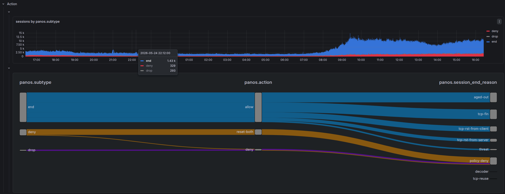
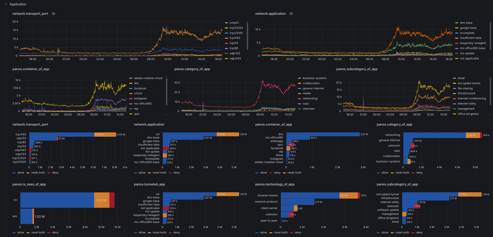

# Palo Alto

Palo Alto-specific dashboard details. For shared concepts — variables, base query structure, direction tabs, action analysis — see the [Dashboard Guide](index.md).

## Dashboards

| Dashboard | File | Description |
|-----------|------|-------------|
| **Traffic** | [`traffic-panos.json`](https://github.com/dr4gon123/flasi/blob/main/grafana/prod/Palo%20Alto/traffic-panos.json) | Session/connection analysis |
| **Threat** | [`threat-panos.json`](https://github.com/dr4gon123/flasi/blob/main/grafana/prod/Palo%20Alto/threat-panos.json) | Security event analysis (virus, spyware, IPS, URL) |
| **Data** | [`ingest-panos.json`](https://github.com/dr4gon123/flasi/blob/main/grafana/prod/Palo%20Alto/ingest-panos.json) | Ingestion health and throughput |
| **Log Fields** | [`log-fields-panos.json`](https://github.com/dr4gon123/flasi/blob/main/grafana/prod/Palo%20Alto/log-fields-panos.json) | Raw field explorer |
| **Streams** | [`streams-panos.json`](https://github.com/dr4gon123/flasi/blob/main/grafana/prod/Palo%20Alto/streams-panos.json) | Data stream statistics |

## Variables

All common variables are documented in the [Dashboard Guide](index.md#variables-filters). PAN-OS specifics:

| Variable | Notes |
|----------|-------|
| `vsys` | Virtual System from `panos.vsys` — equivalent to FortiGate's `vdom` |
| `type` | Hardcoded per dashboard: `"TRAFFIC"` in Traffic, `"THREAT"` in Threat. No `policytype` equivalent |

## Traffic Dashboard

The [Traffic dashboard](https://github.com/dr4gon123/flasi/blob/main/grafana/prod/Palo%20Alto/traffic-panos.json) organizes analysis across two dimensions: direction (outer tabs) and metric type (inner sub-tabs).

### Metric Sub-tabs

Within each direction tab, two sub-tabs slice the same traffic data by a different primary metric:

| Sub-tab | Primary aggregation | Source\|Destination tabs |
|---------|--------------------|-|
| **Sessions** | `count()` — one log ≈ one connection | IP · User\|Host |
| **Bytes** | `sum(network.bytes)` · `sum(network.packets)` · `sum(panos.elapsed)` | IP only |

!!! note "No User|Host tab in Bytes"
    User identity and device data is not available in the Bytes sub-tab — only IP-level volume attribution is shown.

### Sessions Tab

Follows the [standard panel hierarchy](index.md#panel-hierarchy). PAN-OS-specific panels within each row:

#### Source | Destination — IP

| Source | Destination | Description |
|--------|-------------|-------------|
| `source.ip` | `destination.ip` | Top IPs by session count |
| `source.ip/24` | `destination.ip/24` | Top /24 subnets by session count |
| `source.nat.ip` | `destination.nat.ip` | NAT-translated addresses |
| `unique destination.ip by source.ip` | `unique source.ip by destination.ip` | Fanout — distinct IPs reached / reaching each endpoint |
| `unique network.transport_port by source.ip` | `unique network.transport_port by destination.ip` | Port diversity — high values suggest scanning |
| `unique network.application by source.ip` | `unique network.application by destination.ip` | Application diversity per endpoint |

#### Source | Destination — User | Host

Palo Alto combines user identity (from User-ID) and device fingerprinting (from GlobalProtect) into a single tab.

| Source | Destination | Description |
|--------|-------------|-------------|
| `source.user.name` | `destination.user.name` | Authenticated user (from User-ID) |
| `panos.src_host` | `panos.dst_host` | Device hostname |
| `panos.src_osfamily` | `panos.dst_osfamily` | OS family (Windows, macOS, Android…) |
| `panos.src_osversion` | `panos.dst_osversion` | OS version |
| `panos.src_vendor` | `panos.dst_vendor` | Hardware vendor |
| `panos.src_category` | `panos.dst_category` | Device category (laptop, phone, printer…) |

### Bytes Tab

Mirrors the Bytes tab structure in the [Traffic dashboard](index.md#panel-hierarchy), with PAN-OS field naming differences.

#### Bytes | Packets | Duration Row

| Sub-row | Panels |
|---------|--------|
| `sum` | `sum(network.bytes)` and `sum(network.packets)` timeseries |
| `histogram` | Distribution histograms for `bytes`, `packets`, and `panos.elapsed` |

!!! note "elapsed vs duration"
    PAN-OS uses `panos.elapsed` for session duration — the ECS `fgt.duration` equivalent.

#### Source | Destination — IP (Bytes)

Each panel group has **Sum** and **Avg** inner tabs:

| Panel group | Fields |
|-------------|--------|
| Bytes by address | `bytes source.ip` · `bytes source.ip/24` · `bytes source.nat.ip` · `bytes destination.ip` · `bytes destination.ip/24` · `bytes destination.nat.ip` |
| Elapsed by address | `elapsed source.ip` · `elapsed source.ip/24` · `elapsed source.nat.ip` · `elapsed destination.ip` · `elapsed destination.ip/24` · `elapsed destination.nat.ip` |

#### Application (Bytes)

Each panel has **Sum** and **Histogram** inner tabs:

| Panel | Description |
|-------|-------------|
| `bytes network.transport_port` | Bytes by `protocol/port` |
| `bytes network.application` | Bytes by detected application |
| `bytes panos.container_of_app` | Bytes by container app |
| `bytes panos.category_of_app` | Bytes by application category |
| `elapsed network.transport_port` | Connection duration by port |
| `elapsed network.application` | Connection duration by application |
| `elapsed panos.category_of_app` | Connection duration by category |

### Interfaces / Zones Row

The Interfaces / Zones row uses **chord diagrams** (`esnet-chord-panel`) — a visualization unique to PAN-OS with no FortiGate equivalent. These show traffic flow relationships between pairs:

| Panel | Field | Description |
|-------|-------|-------------|
| Zone-to-zone | `observer.ingress.zone.name by observer.egress.zone.name` | Session volume between security zones |
| Interface-to-interface | `observer.ingress.interface.name by observer.egress.interface.name` | Physical/logical interface pair flows |

Chord diagrams are particularly useful for understanding traffic routing and verifying zone policy coverage.

## Threat Dashboard

The [Threat dashboard](https://github.com/dr4gon123/flasi/blob/main/grafana/prod/Palo%20Alto/threat-panos.json) focuses on security engine events (virus, spyware, IPS, URL filtering, file blocking).

### Tab Structure

Unlike FortiGate's UTM dashboard where rows are conditionally shown/hidden by subtype, PAN-OS uses a tab-per-subtype structure with all rows always visible. It adds a **summary** tab not present in FortiGate:

| Tab | Purpose |
|-----|---------|
| `summary` | Aggregated view across all threat subtypes |
| `$subtype` | Dynamic per-subtype tab — repeats for each active subtype (virus, spyware, vulnerability, url, etc.) |

### Threat Rows

All rows are always visible — scope is driven by the `direction` and `subtype` tab selection rather than conditional rendering:

| Row | Notes |
|-----|-------|
| Metrics | Always visible |
| Subtype | Breakdown by `panos.subtype` and `panos.severity` — plus a **correlation** panel linking subtype to session end reason |
| Rule | Policy attribution |
| Geo | Country geomaps |
| Threat ID \| Threat Category \| Misc | `panos.threatid`, `panos.threat_category`, severity breakdown |
| Source \| Destination | IP and user analysis |
| Application | Service and application breakdown |

## Action

Palo Alto separates **action** (what the firewall decided) from **session_end_reason** (why the session ended). This differs from FortiGate where both collapse into `fgt.action`.

This distinction matters in Traffic analysis: `panos.action` tells you what the policy decided, while `panos.session_end_reason` tells you what actually terminated the session — which can differ when a threat is detected mid-session on an otherwise allowed flow. `panos.flags` encodes session properties (symmetric return, decrypted, captive portal, etc.) that provide additional context.

Traffic Field reference: [Traffic Log Fields](https://docs.paloaltonetworks.com/ngfw/administration/monitoring/use-syslog-for-monitoring/syslog-field-descriptions/traffic-log-fields) — key fields: `action`, `session_end_reason`, `flags`.

Threat Field reference: [Threat Log Fields](https://docs.paloaltonetworks.com/ngfw/administration/monitoring/use-syslog-for-monitoring/syslog-field-descriptions/threat-log-fields) — key fields: `action`, `flags`.



### Sankey Diagram

Both **Traffic** and **Threat** dashboards use a [Sankey diagram](https://grafana.com/grafana/plugins/netsage-sankey-panel/) to visualize the relationship between:

```
panos.subtype → panos.action → panos.session_end_reason
```

This is the primary way to answer: "when a threat was detected, what did the firewall actually do, and how did the session end?"

## Service | Application

PAN-OS deep packet inspection classifies applications with significantly richer metadata than FortiGate:

| Field | Description |
|-------|-------------|
| `network.application` (`panos.app`) | Detected application name |
| `panos.category_of_app` | Application category |
| `panos.subcategory_of_app` | Application sub-category |
| `panos.technology_of_app` | Underlying technology (browser-based, client-server, etc.) |
| `panos.container_of_app` | Parent application container |
| `panos.tunneled_app` | Application tunneled inside another |
| `panos.risk_of_app` | Risk level (1–5) |
| `panos.characteristic_of_app` | Behavioral characteristics (transfers-files, tunnels-other-apps, etc.) |
| `panos.is_saas_of_app` | SaaS classification |
| `panos.sanctioned_state_of_app` | Whether the app is sanctioned by policy |



## Overrides

### Action Colors — Traffic

Traffic action values use a color scale that reflects severity of intervention — blue for permissive, shades of orange/red for resets, solid red for hard blocks, gray for silent drops:

| Color | Action values |
|-------|--------------|
| Dark blue | `allow` |
| Dark red | `block`, `deny` |
| Gray | `drop`, `drop-ICMP` — silent drop, no RST sent |
| Orange | `reset-both` |
| Dark orange | `reset-client` |
| Light orange | `reset-server` |

### Action Colors — Threat

Threat action values use a finer-grained scale reflecting both the threat response and URL/WildFire-specific actions:

| Color | Action values |
|-------|--------------|
| Blue | `allow`, `continue` |
| Dark blue | `override` |
| Light orange | `alert`, `block-continue` |
| Orange | `reset-client`, `syncookie-sent` |
| Semi-dark orange | `reset-server` |
| Dark orange | `reset-both` |
| Red | `block-ip` |
| Semi-dark red | `drop` |
| Dark red | `deny`, `block-url`, `block` |
| Super-light red | `random-drop` |
| Purple | `block-override` |
| Dark purple | `sinkhole`, `override-lockout` |

### Severity Colors

`panos.severity` uses a traffic-light scale across both Traffic and Threat dashboards:

| Color | Severity |
|-------|---------|
| Gray / Semi-dark blue | `informational` |
| Green | `low` |
| Orange | `medium` |
| Red | `high` |
| Dark red | `critical` |

### Unit Scaling

Identical to FortiGate dashboards:

| Pattern | Unit |
|---------|------|
| `*bytes` | Decimal bytes — auto-scales to KB, MB, GB |
| `*packets` | SI short — auto-scales to K, M, G |
| `*duration` / `*elapsed` | Duration format (s, m, h) |
