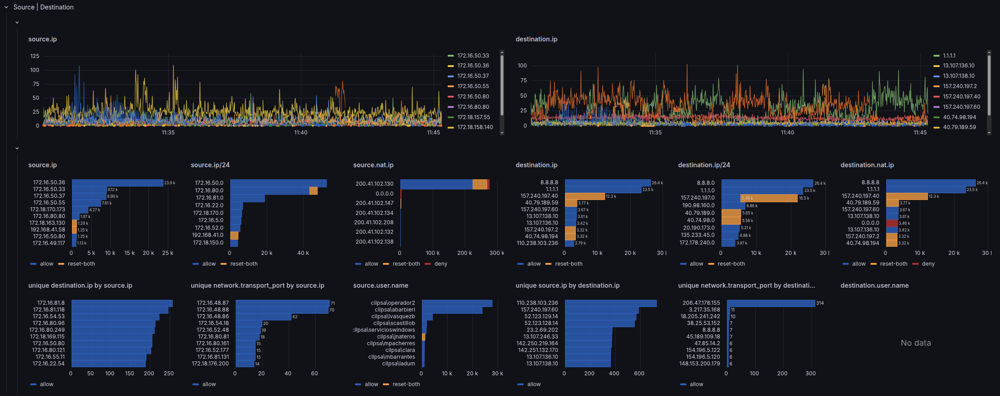

# Palo Alto

## Variables

| Variable | Query Source | Notes |
|----------|--------------|-------|
| `firewall` | `_stream: {panos.type=$type}` | Populated from `panos.device_name` |
| `vsys` | `_stream: {panos.type=$type, panos.device_name in (${firewall})}` | Virtual System from `panos.vsys`. Equivalent to FortiGate's `vdom` |
| `type` | Custom (hardcoded per dashboard) | `"TRAFFIC"` in Traffic dashboard, `"THREAT"` in Threat dashboard. No `policytype` equivalent |
| `subtype` | Query | From `panos.subtype` — varies by log type |
| `direction` | Custom | Options: `outbound`, `inbound`, `internal`, `external` |
| `action` | Query | From `panos.action` — `allow`, `deny`, `drop`, `reset-both`, etc. |
| `Logsql` | Text | Custom filter, default `*` |


## Base Query

```plaintext
_stream:{panos.device_name in(${firewall:doublequote}),panos.vsys in(${vsys:doublequote}),panos.type=${type:doublequote},panos.subtype in(${subtype:doublequote}),network.direction=${direction:doublequote}}
| panos.action:in(${action:doublequote}) AND ${Logsql:raw}
| stats by (panos.srcloc) count() results
| sort by (results) desc
| limit 10
```

## Traffic Dashboard

The Traffic dashboard (`traffic-panos.json`) is organized into direction tabs (outbound/inbound/internal/external), each with two metric sub-tabs:

| Sub-tab | Metric |
|---------|--------|
| Sessions | `count()` — one log ≈ one connection |
| Bytes | `sum(bytes)` — total volume transferred |

Within each sub-tab, rows follow the standard [panel hierarchy](index.md#panel-hierarchy).

### Zone & Interface Chord Diagrams

The Traffic dashboard includes **chord diagrams** (`esnet-chord-panel`) in the Interfaces/Zones row — a visualization unique to Palo Alto that has no FortiGate equivalent. These show traffic flow relationships:

- **Zone-to-zone** — volumes of sessions flowing between security zones (e.g., untrust → trust)
- **Interface-to-interface** — physical/logical interface pair flows

These are particularly useful for understanding traffic routing and zone policy coverage.

## Threat Dashboard

The Threat dashboard (`threat-panos.json`) focuses on security engine events (virus, spyware, IPS, URL filtering, file blocking). It has a different tab structure from Traffic:

### Tab Structure

| Tab | Purpose |
|-----|---------|
| `summary` | Aggregated view across all threat subtypes |
| `$subtype` | Dynamic per-subtype breakdown — one tab per active subtype (virus, spyware, vulnerability, url, etc.) |

The dynamic `$subtype` tab pattern means the dashboard automatically adapts to whatever threat subtypes are present in your data.

### Threat Rows

Each tab contains rows for: Metrics, Action, Geo, Source\|Destination, Application, Rule, and threat-specific dimensions:

- **Subtype row** — breakdown by `panos.subtype` (virus, spyware, vulnerability, url, file, wildfire…)
- **Threat ID | Threat Category | Misc** row — `panos.threatid`, `panos.threat_category`, severity

### Sankey Diagram

The Threat dashboard uses a Sankey diagram to visualize the relationship between:

```
panos.threat/content_type → panos.action → panos.session_end_reason
```

This is the primary way to answer "when a threat was detected, what did the firewall actually do, and how did the session end?"

## Action


Palo Alto separates the concept of **action** (what the firewall decided to do) from **session_end_reason** (why the session ended). This is different from FortiGate's approach where both concepts collapse into `fgt.action`.

This distinction matters in Traffic analysis: `panos.action` tells you what the policy decided, while `panos.session_end_reason` tells you what actually terminated the session — which can differ when a threat is detected mid-session on an otherwise allowed flow. `panos.flags` encodes session properties (symmetric return, decrypted, captive portal, etc.) that provide additional context.

We explore the relation between `panos.subtype`, `panos.action`, and `panos.session_end_reason` on a [Sankey Diagram](https://grafana.com/grafana/plugins/netsage-sankey-panel/).

Traffic Field reference: [Traffic Log Fields](https://docs.paloaltonetworks.com/ngfw/administration/monitoring/use-syslog-for-monitoring/syslog-field-descriptions/traffic-log-fields) — key fields: `action`, `session_end_reason`, `flags`.

Threat Field reference: [Threat Log Fields](https://docs.paloaltonetworks.com/ngfw/administration/monitoring/use-syslog-for-monitoring/syslog-field-descriptions/threat-log-fields) — key fields: `action`, `flags`.

{data-gallery="action-gallery" data-title="Palo Alto Action"}

## Source | Destination

{data-gallery="source-destination-gallery" data-title="Palo Alto Source Destination"}

## Service | Application

{data-gallery="service-application-gallery" data-title="Palo Alto Service Application"}

## Overrides

### Action Colors (Traffic)

Traffic action values use a color scale that reflects severity of intervention — blue for permissive, shades of orange/red for resets, solid red for hard blocks, gray for silent drops:

| Color | Action values |
|-------|--------------|
| Dark blue | `allow` |
| Dark red | `block`, `deny` |
| Gray | `drop`, `drop-ICMP` — silent drop, no RST sent |
| Orange | `reset-both` |
| Dark orange | `reset-client` |
| Light orange | `reset-server` |

### Action Colors (Threat)

Threat action values use a finer-grained scale reflecting both the threat response and the URL/WildFire-specific actions:

| Color | Action values |
|-------|--------------|
| Blue | `allow`, `continue` |
| Dark blue | `override` |
| Light orange | `alert`, `block-continue` |
| Orange | `reset-client`, `syncookie-sent` |
| Semi-dark orange | `reset-server` |
| Dark orange | `reset-both` |
| Red | `block-ip` |
| Semi-dark red | `drop` |
| Dark red | `deny`, `block-url`, `block` |
| Super-light red | `random-drop` |
| Purple | `block-override` |
| Dark purple | `sinkhole`, `override-lockout` |

### Severity Colors

Severity fields (`panos.severity`) use a traffic-light scale across both Traffic and Threat dashboards:

| Color | Severity |
|-------|---------|
| Gray / Semi-dark blue | `informational` |
| Green | `low` |
| Orange | `medium` |
| Red | `high` |
| Dark red | `critical` |

### Unit Scaling

Fields are auto-scaled based on their name pattern — identical to FortiGate dashboards:

| Pattern | Unit |
|---------|------|
| `*bytes` | Decimal bytes — auto-scales to KB, MB, GB |
| `*packets` | SI short — auto-scales to K, M, G |
| `*duration` | Duration format (s, m, h) |

## Dashboard Files

| Dashboard | File | Description |
|-----------|------|-------------|
| Traffic | `traffic-panos.json` | Session/connection analysis |
| Threat | `threat-panos.json` | Security event analysis (virus, spyware, IPS, URL) |
| Ingest | `ingest-panos.json` | Ingestion health and throughput. The `type` variable is query-based (not custom) — PAN-OS log types vary by deployment and are discovered dynamically |
| Log Fields | `log-fields-panos.json` | Raw field explorer |
| Streams | `streams-panos.json` | Data stream statistics |
