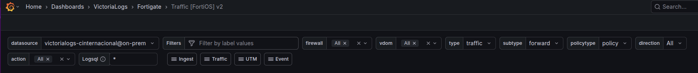
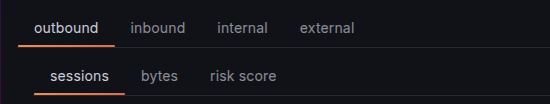
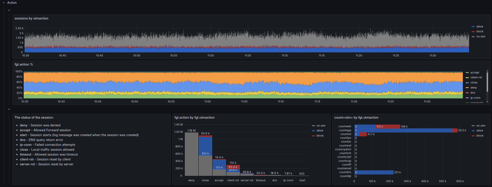
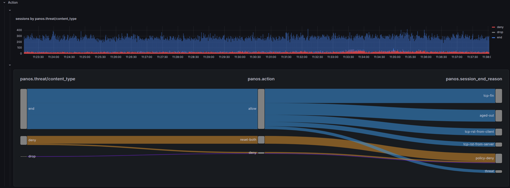
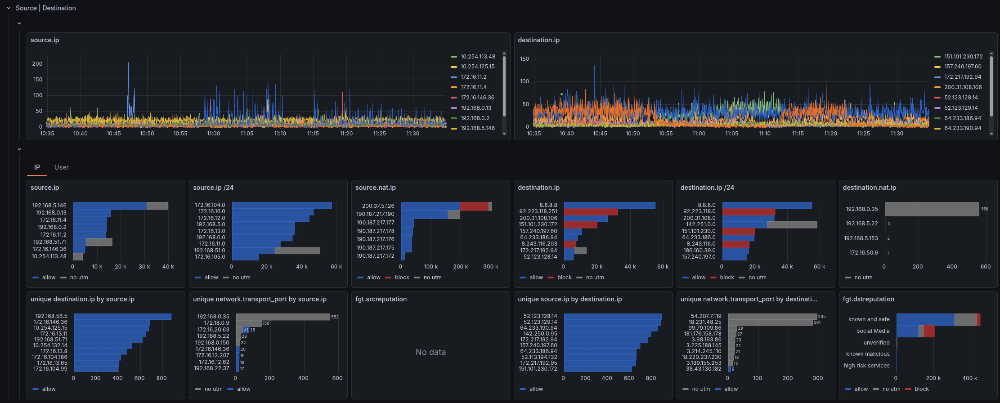
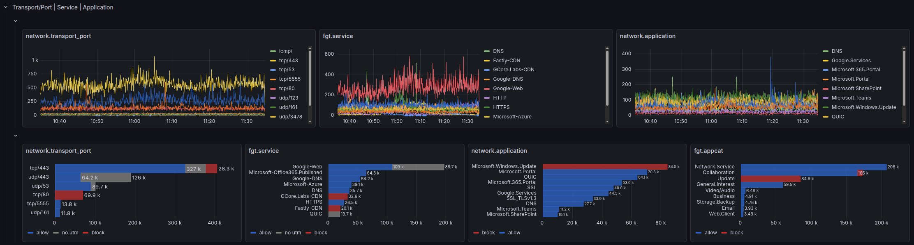
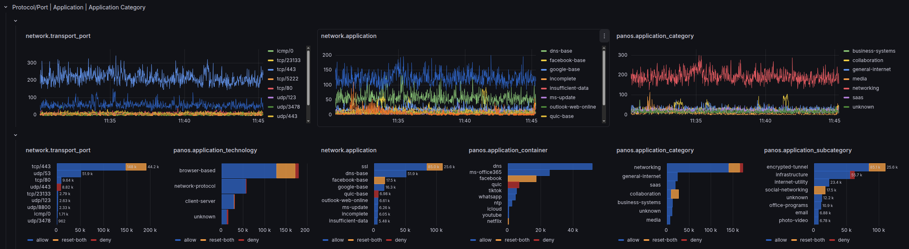

# Usage

Hopefully, our dashboards are very [intuitive](values.md) to use.

They are intended for SOC analysts to use on threat hunting activities, fine-tuning firewall policies, or any other activity that requires going deep into your data.

We tried to make dashboards look alike, no matter the vendor or dataset, so we provide a coherent user experience across FortiGate and Palo Alto deployments.

## Dashboard Suite

Both vendors share the same set of dashboards, each with a distinct purpose:

| Purpose | FortiGate | Palo Alto |
|---------|-----------|-----------|
| Traffic session analysis | Traffic [FortiOS] | Traffic [PAN-OS] |
| Security event analysis | UTM [FortiOS] | Threat [PAN-OS] |
| Ingestion health & throughput | Ingest [FortiOS] | Ingest [PAN-OS] |
| Stream schema explorer | Streams [FortiOS] | Streams [PAN-OS] |
| Full Dataset & ECS Mapping | Log Fields [FortiOS] | Log Fields [PAN-OS] |

**Traffic** and **UTM/Threat** dashboards are the primary analysis tools.

**Ingest** and **Streams** are operational dashboards for understanding what data you have and how it's flowing in.

**Log Fields** are a reference guide showing raw datasets, original log field names and their meanings, and translated ECS fields mappiong.

!!! note "FortiGate extras"
    FortiOS includes 2 additional dashboards related to **event** dataset.
    - SSL VPN
    - System: convering Health, Configuration Changes and Logging Attempts

## Variables & Filters

All dashboard filters are exposed at the top of the page, allowing you to slice and dice the data as needed. Variables are ordered hierarchically — selecting a firewall narrows down vdom/vsys options, which narrows down subtypes, and so on.

Both vendors follow the same variable cascade:

```
datasource → Filters → firewall → vdom / vsys → type → subtype → direction → action → Logsql
```

| Variable | FortiGate field | Palo Alto field | Notes |
|----------|-----------------|-----------------|-------|
| `datasource` | — | — | Victoria Logs connection |
| `Filters` | — | — | Ad-hoc filter on any field |
| `firewall` | `log.syslog.hostname` | `panos.device_name` | Multi-select |
| `vdom` / `vsys` | `fgt.vd` | `panos.vsys` | Virtual domain / Virtual system |
| `type` | `fgt.type` | `panos.type` | Hardcoded per dashboard (traffic, utm/threat…) |
| `subtype` | `fgt.subtype` | `panos.subtype` | Populated from data |
| `direction` | `network.direction` | `network.direction` | outbound, inbound, internal, external |
| `action` | `fgt.action` | `panos.action` | Populated from data |
| `Logsql` | — | — | Raw [LogsQL](https://docs.victoriametrics.com/victorialogs/logsql/) injection |

!!! note "FortiGate extras"
    FortiGate Traffic dashboard have two additional variables not present in PAN-OS: `policytype` (filters by `fgt.policytype`) and `crscore`, a toggle unique to the UTM dashboard that applies a risk score threshold filter.

!!! tip "Advanced Filtering"
    The `Logsql` variable lets you inject raw LogsQL into every query. Use it for complex filters that aren't covered by the standard variables, such as:
    ```
    fgt.source.ip:ipv4_range("192.168.1.0/24") AND destination.port:>1024
    ```

## Navigation

We also have a navigation bar to move between the different dashboards of the dataset:



| FortiGate | Palo Alto |
|-----------|-----------|
| Ingest | Performance |
| Traffic | Traffic |
| UTM | Threat |
| Event | |

## Base Query Shell

All panels in a dashboard share a common base query structure. It always has three parts:

```
_stream:{<stream filters>}
| <filter> AND <Logsql>
| stats by (<field>) <aggregation>
```

**Stream block** — scopes the dataset to a specific firewall, virtual domain, log type, subtype, and direction. This is evaluated at the index level and is the fastest filter.

**Filter block** — applies additional filters (mainly $action) and custom LogsQL filters on top of the stream result.

**Stats block** — aggregates results, typically `count()` for sessions or `sum(bytes)` for volume.

=== "FortiGate"

    ```plaintext
    _stream:{log.syslog.hostname in (${firewall:doublequote}),fgt.vd in (${vdom:doublequote}),fgt.type=${type:doublequote},fgt.subtype=${subtype:doublequote},fgt.policytype=${policytype:doublequote},network.direction in (${direction:doublequote}),fgt.logid!=0000000020}
    | fgt.action:in(${action:doublequote}) AND ${Logsql:raw}
    | stats by (fgt.srccountry) count() results
    | sort by (results) desc
    | limit 10
    ```

=== "Palo Alto"

    ```plaintext
    _stream:{panos.device_name in(${firewall:doublequote}),panos.vsys in(${vsys:doublequote}),panos.type=${type:doublequote},panos.subtype in(${subtype:doublequote}),network.direction=${direction:doublequote}}
    | panos.action:in(${action:doublequote}) AND ${Logsql:raw}
    | stats by (panos.srcloc) count() results
    | sort by (results) desc
    | limit 10
    ```

## Tab Structure

### Direction Tabs

We segment the analysis by **`network.direction`** — tabs across the top represent different traffic directions:

- **Outbound** — Traffic initiated from internal networks going out
- **Inbound** — Traffic coming from external networks into internal
- **Internal** — Traffic between internal network segments
- **External** — Traffic between external networks (rare but possible)

The segmentation matters: an attack originating from the internet is completely different from an internal host generating suspicious traffic.



### Sub-tabs: Traffic Dashboard

Within each direction tab, the **Traffic** dashboard splits analysis by metric:

| Sub-tab | Aggregation | Notes |
|---------|-------------|-------|
| Sessions | `count()` | 1 log ≈ 1 connection. Not 100% accurate but cheap to calculate. For exact counts, `count_uniq(session.id)` is resource-intensive |
| Bytes | `sum(bytes)` | Total volume transferred |
| Risk Score | `sum(fgt.crscore)` | Arbitrary puntation about the risk associated to an specific session. *Only FortiGate* |

### Sub-tabs: UTM / Threat Dashboard

The **UTM** (FortiGate) and **Threat** (Palo Alto) dashboards split by **subtype** — the category of security engine that generated the event.

- A **summary** tab — aggregated view across all subtypes. *Only Palo Alto*
- A **dynamic per-subtype** tab — automatically adapts to whatever subtypes are present in your data


## Panel Hierarchy

Within each tab of the **Traffic** dashboard (both vendors), panels follow a consistent top-to-bottom layout:

| Row | Content |
|-----|---------|
| Metrics | Summary stats — total sessions, bytes, unique IPs |
| Action | Allow/block split — timeseries and bar breakdowns by action |
| Geo | Country geomaps — source and destination geographic distribution |
| Rule | Policy attribution — which firewall rules are matching traffic |
| Interfaces | Interface/zone metrics — traffic by interface or security zone |
| Source \| Destination | IP analytics — top sources, destinations, unique counts |
| Application | Service & app details — ports, protocols, detected applications |

This structure lets analysts quickly identify anomalies at the top, investigate at the middle, and drill down into specific entities at the bottom.

The **UTM/Threat** dashboard follows a similar structure but omits the Interfaces row and adds threat-specific rows (Subtype, Threat ID/Category).

## Action

Why do you buy a firewall in the first place??? **To block!**

Understanding what **action** your firewall took for each connection is the most relevant piece of information for security analysis. Every investigation starts here: "What did the firewall do?"

This is why **every bar chart across both Traffic and UTM/Threat dashboards is broken down by action** — whether a session was allowed or blocked is always the first dimension of any analysis.

### Action in the Traffic Dashboard

In the Traffic dashboard, *action* has vendor-specific nuance — each vendor models policy decisions, security engine outcomes, and session termination differently:

| | FortiGate | Palo Alto |
|--|-----------|-----------|
| **Policy action** | `fgt.action` — what the policy decided, or how the connection ended if allowed | `panos.action` — what the firewall policy decided |
| **Security engine** | `fgt.utmaction` — action taken by the UTM engine (web filter, AV, IPS…) | looked up in the Threat dashboard when `panos.session_end_reason` = `threat` |
| **Session termination** | (part of `fgt.action` for closed sessions) | `panos.session_end_reason` — why the session ended, separate from policy action |

=== "FortiGate"

    We combine the analysis of both `fgt.action` and `fgt.utmaction` in a timeline, percentage, and absolute fashion. The UTM dashboard further breaks down details by UTM engine (web filter, antivirus, IPS, etc.).

    {data-gallery="action-gallery" data-title="Fortigate Action"}

=== "Palo Alto"

    We explore the relation between `panos.subtype`, `panos.action`, and `panos.session_end_reason` on a [Sankey Diagram](https://grafana.com/grafana/plugins/netsage-sankey-panel/).

    {data-gallery="action-gallery" data-title="Palo Alto Action"}

## Source | Destination

We dig further into the most elemental dimensions of a network connection: Source and Destination.

We explore its broadest dimensions: IP, User, Device.

- **Top row** — timeline analysis
- **Middle row** — total aggregated values: `count of logs over the whole time window`
- **Bottom row** — advanced metrics: `unique count of destination IP per source IP`

=== "FortiGate"

    {data-gallery="source-destination-gallery" data-title="Fortigate Source Destination - IP"}
    {data-gallery="source-destination-gallery" data-title="Fortigate Source Destination - User"}

=== "Palo Alto"

    {data-gallery="source-destination-gallery" data-title="Palo Alto Source Destination"}

## Service | Application

`service` is the combination of `protocol` + `destination port`, like `https` = `tcp/443`.

### Service Field

FortiGate's `fgt.service` field can hold three different values depending on what matched:

1. An **Internet Service** name (e.g. `Google-DNS`) — if the destination matched a Fortinet Internet Service database entry
2. A **configured service object** name (e.g. `HTTPS`, `CUSTOM-APP`) — if the session matched a policy service object
3. A **protocol/port notation** (e.g. `tcp/443`) — if no service object matched

This inconsistency makes `fgt.service` unreliable for aggregation: the same port can appear under three different values depending on how the policy is configured.

PAN-OS does **not** produce an equivalent service field.

### network.transport_port

To solve the `fgt.service` inconsistency and bridge the PAN-OS gap, we normalize both vendors into a single computed field:

```
network.transport_port = protocol + "/" + destination.port   →   e.g. tcp/443, udp/53
```

This field is consistent across both vendors and is what the dashboards use for all service/port analysis.

### Application

Application visibility depth differs significantly between vendors:

| | FortiGate | Palo Alto |
|-|-----------|-----------|
| App name | `network.application` (from `fgt.app`) | `panos.app` |
| Category | `fgt.appcat` | `panos.category_of_app` |
| Sub-category | — | `panos.subcategory_of_app` |
| Technology | — | `panos.technology_of_app` |
| Risk level | — | `panos.risk_of_app` |
| Characteristics | — | `panos.characteristic_of_app` |
| Container app | — | `panos.container_of_app` |
| Tunneled app | — | `panos.tunneled_app` |
| SaaS | — | `panos.is_saas_of_app` |
| Sanctioned | — | `panos.sanctioned_state_of_app` |

Palo Alto's deep packet inspection engine classifies applications with much richer metadata, while FortiGate provides name and category only.

=== "FortiGate"

    {data-gallery="service-application-gallery" data-title="Fortigate Service Application"}

=== "Palo Alto"

    {data-gallery="service-application-gallery" data-title="Palo Alto Service Application"}


## Vendor-Specific Documentation

While the overall structure is consistent, each firewall vendor has unique fields, variables, and query patterns:

- [FortiGate](fortinet.md) — Variables, fields, UTM engines, risk score, logid filtering
- [Palo Alto](paloalto.md) — Variables, fields, threat types, session end reasons, zone/interface chord diagrams
