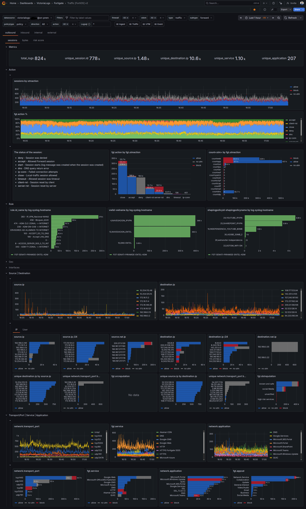
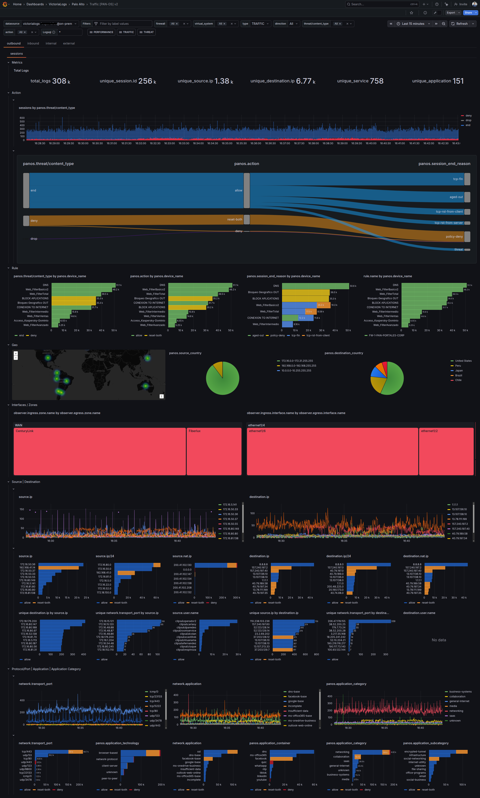

# Usage

Hopefully, our dashboards are very [intuitive](values.md) to use.

They are intended for SOC analysts to use on threat hunting activities, fine-tuning firewall policies, or any other activity that requires going deep into your data.

We tried to make dashboards look alike, not matter the vendor or dataset, so we provide a coherent user experience.

## Dashboard Architecture

Our dashboards follow a consistent **top-to-bottom** information hierarchy:

```
┌─────────────────────────────────────────┐
│  TOP: General Metrics & Overview        │  ← High-level totals, trends
├─────────────────────────────────────────┤
│  MIDDLE: Main Field Analysis            │  ← Action breakdowns, key dimensions
├─────────────────────────────────────────┤
│  BOTTOM: Detailed Dimensions           │  ← Source/Dest, Service, User deep-dive
└─────────────────────────────────────────┘
```

This structure allows analysts to quickly identify anomalies at the top, investigate at the middle, and drill down into specific entities at the bottom.

## Variables & Filters

All dashboard filters are exposed at the top of the page, allowing you to slice and dice the data as needed. Variables are ordered hierarchically — selecting a firewall narrows down VDOM options, which narrows down log types, and so on.

| Variable | Type | Description |
|----------|------|-------------|
| `datasource` | Datasource | Victoria Logs or Elasticsearch connection |
| `Filters` | Ad-hoc | Apply custom filters to any field dynamically |
| `firewall` | Query | Firewall hostname(s) — populated from available data |
| `vdom` | Query | Virtual Domain (Fortinet) / VSYS (Palo Alto) |
| `type` | Custom | Log type: `traffic`, `utm`, `event` (Fortinet) |
| `subtype` | Query | Log subtype: `forward`, `local`, `multicast`, etc. |
| `policytype` | Query | Policy type: `policy`, `interface`, `any` |
| `direction` | Custom | Traffic direction: `outbound`, `inbound`, `internal`, `external` |
| `action` | Query | Firewall action: `accept`, `drop`, `deny`, `close`, etc. |
| `Logsql` | Text | Custom [LogsQL](https://docs.victoriametrics.com/victorialogs/logsql/) filter — set to `*` for no additional filtering |

!!! tip "Advanced Filtering"
    The `Logsql` variable lets you inject raw LogsQL into every query. Use it for complex filters that aren't covered by the standard variables, such as:
    ```
    fgt.srccountry!="United States" AND destination.port>1024
    ```

## Tab Structure

Each dashboard is organized by **`network.direction`** — tabs across the top represent different traffic directions:

- **Outbound** — Traffic initiated from internal networks going out
- **Inbound** — Traffic coming from external networks into internal
- **Internal** — Traffic between internal network segments
- **External** — Traffic between external networks (rare but possible)

Within each direction tab, metrics are further segmented by **one primary metric per tab**:

- Sessions (connection count)
- Bytes (volume transferred)
- Risk Score (Fortinet only)

This ensures each visualization focuses on a single metric without mixing aggregation types.


## Base Query Pattern

All panels in a dashboard share a common **base query** that defines the dataset scope. This ensures consistency across visualizations:

```plaintext
_stream:{log.syslog.hostname in (${firewall}),fgt.vd in (${vdom}),fgt.type=${type},fgt.subtype=${subtype},fgt.policytype=${policytype},network.direction in (${direction})} | fgt.action:in(${action}) AND ${Logsql}
```

The query flows through variables in sequence:
1. **Stream filter** — Defines the data stream (firewall, vdom, type, subtype, direction)
2. **Action filter** — Filters by firewall action
3. **Custom LogsQL** — Applies user-defined filters

This pattern ensures that every panel respects the same filter context.

## Layout Pattern

Panels within each tab follow a consistent layout:

| Row | Content | Example |
|-----|---------|---------|
| Top | Timeline visualizations | Time series of sessions over selected period |
| Middle | Aggregated totals | Bar charts showing top sources/destinations |
| Bottom | Detailed dimensions | Tables with drill-down capability |

Upper panels focus on vendor-specific fields split by action (allow vs. block). Lower panels explore common network entities like `source.ip`, `destination.ip`, `service`, and `user`.

## Vendor-Specific Documentation

While the overall structure is consistent, each firewall vendor has unique fields, variables, and query patterns:

- [FortiGate](fortinet.md) — Variables, fields, UTM engines, risk score
- [Palo Alto](paloalto.md) — Variables, fields, threat types, session end reasons

Let's go through our **Traffic Dashboard**

{width="350px" data-gallery="dashboards-gallery" data-title="Fortigate Traffic Dashboard"}
{width="350px" data-gallery="dashboards-gallery" data-title="Palo Alto Traffic Dashboard"}

## Navigation and Filtering

We expose all filters than affect the data displayed on the dashboard. This way, you can navigate and filter the data as you please.


We also have a navigation bar to move between the different dashboards of the dataset:

| Fortinet | Palo Alto |
|---------|---------|
| Ingest | Performance |
| Traffic | Traffic |
| UTM | Threat |
| Event |  |

## Segmentation

We have segmented the analysis by `network.direction`


It is completely different if we have an attack in a connection coming from the internet than if an IP inside our servers network generated it.

Inside each direction, the analysis is done by a particular parameter:

- Sessions (connections)

    We make the assumption that `1 log = 1 connection`. It is not 100% accurate, but a good approximation that is cheap to calculate. For 100% accuracy, we will have to calculate `unique count of session.id` which is very resource expensive.

- Bytes (soon in Palo Alto)
- [Risk score](https://docs.fortinet.com/document/fortigate/7.2.0/administration-guide/903511/threat-weight) - Only on Fortinet dashboard

## Action

Why do you buy a firewall in the first place??? **To block!**

Understanding what **action** your firewall took for each connection is the most relevant piece of information for security analysis. Every investigation starts here: "What did the firewall do?"

However, each firewall vendor has a different approach on how to understand *action* and what do they mean by it.

It is a mixture of:

- what the configuration for that particular flow was
- how the connection ended
- whether there was a security flaw on that session

|Fortigate|Palo Alto|
|---------|---------|
| <ul><li>`action`: action taken by firewall policy, or if accepted, it refers to how the connection was ended.</li><li>`utmaction`: action took by the UTM engine, in case connection triggered at least of them.</li></ul>|<ul><li>`threat/content_type`: action took by the security engine.</li><li>`action`: action taken by firewall policy.</li><li>`session_end_reason`: why the session ended.</li></ul>|

### Fortigate

We combine the analysis of both `action` and `utmaction` in a timeline, percentage, and absolute fashion. As well as dissecting `utmaction` into the UTM engines that influence it.

{data-gallery="action-gallery" data-title="Fortigate Action"}

### Palo Alto

We explore the relation between `threat/content_type`, `action` and `session_end_reason` on a [Sankey Diagram](https://grafana.com/grafana/plugins/netsage-sankey-panel/).

{data-gallery="action-gallery" data-title="Palo Alto Action"}

## Source | Destination

We dig further into the most elemental dimensions of a network connection: Source and Destination.

We try to explore its broadest: IP, network, user, etc.

- On the top row, there is the timeline analysis.
- On the middle row, there are total aggregated values: `count of logs over the whole time window`
- On the bottom row, there are more advanced metrics that unveil more subtle insights like: `unique count of destination IP per source IP`

### Fortigate

Fortinet offers a lot of information about IP, besides just the IP address. We have split the analysis on 2 tabs

- IP

    IP address, /24 network, NATed IP and [IP Reputation](https://docs.fortinet.com/document/fortigate/7.6.4/administration-guide/68937/ip-reputation-filtering)
{data-gallery="source-destination-gallery" data-title="Fortigate Source Destination - IP"}

- User

    We explore `user` and its derivations.
{data-gallery="source-destination-gallery" data-title="Fortigate Source Destination - User"}

### Palo Alto

{data-gallery="source-destination-gallery" data-title="Palo Alto Source Destination"}

## Service | Application

`service` is the combination of `protocol` + `destination port`, like `https` is actually `tcp/443`

### Fortigate

However, on Fortinet, `service` gets the value of what you defined on `Policy and Objects/Services` **or** the [Internet Service](https://docs.fortinet.com/document/fortigate/7.6.4/administration-guide/849970/internet-services) that has matched that IP.

As we can not have 100% certainty that `tcp/443` = `https`. We have defined a new field: `network.transport_port`

{data-gallery="service-application-gallery" data-title="Fortigate Service Application"}

### Palo Alto

Palo Alto does not provide `service` field, so we also defined: `network.transport_port`
{data-gallery="service-application-gallery" data-title="Palo Alto Service Application"}
